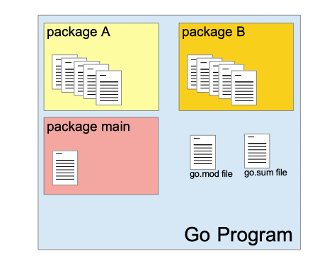
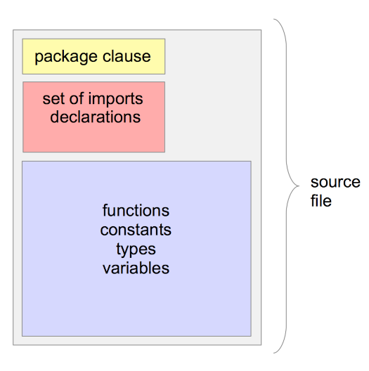

### Alguns avisos:

Recomendo fortemente que você possua algum conhecimento em lógica de programação antes de prosseguir. Você pode conferir algumas sugestões [AQUI](./LINKS.md)

Antes de começar certifique-se de ter instalado o Go na sua máquina. Confira o tutorial de [INSTALAÇÃO](./INSTALA%C3%87%C3%83O.md)

# TUTORIAL

## Pacotes

Todo programa em Go é feito com o uso de **pacotes** (packages)

Um pacote é composto de um ou mais **arquivos-fonte** (source files). Dentro desses arquivos o programador Go declara:

### Pacote:
```
- Constantes

- Variáveis

- Funções

- Tipos e Métodos
```



Para rodar um programa em Go você precisará do pacote **main**

O pacote **main** normalmente é composto de um único arquvo.

A função **main** é o ponto de entrada de todo programa escrito em Go.

### Arquivo-fonte:
```
- Condiçoes de uso de um Pacote (package clause)

- Conjunto de importaçoes disponíveis (set of imports declarations)

- Constantes

- Variáveis

- Funções

- Tipos e Métodos
```


Exemplo de um programa escrito em Go:
```go
package main

import (
	"fmt"
	"math/rand"
)

func main() {
	fmt.Println("Meu número favorito é: ", rand.Intn(10))
}
```